# WMS AI Architecture Documentation

## Overview

WMS AI is built using Domain-Driven Design (DDD), Event-Driven Architecture (EDA), and CQRS patterns. The system is decomposed into bounded contexts that communicate asynchronously via domain events.

## C4 Model Diagrams

### Level 1: System Context

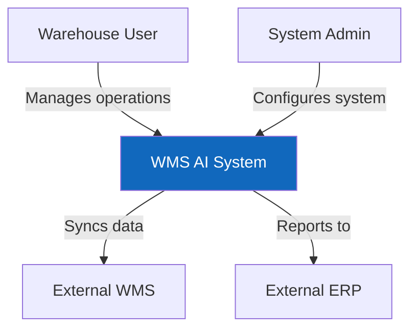

### Level 2: Container Diagram

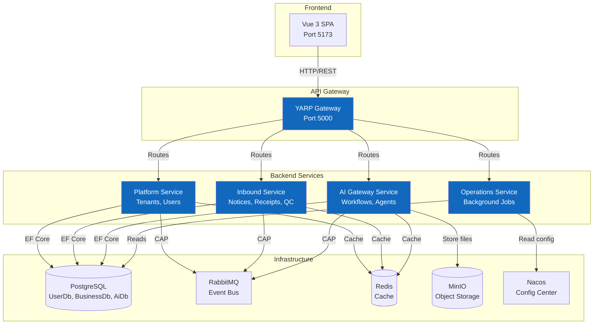

### Level 3: Component Diagram - Platform Service

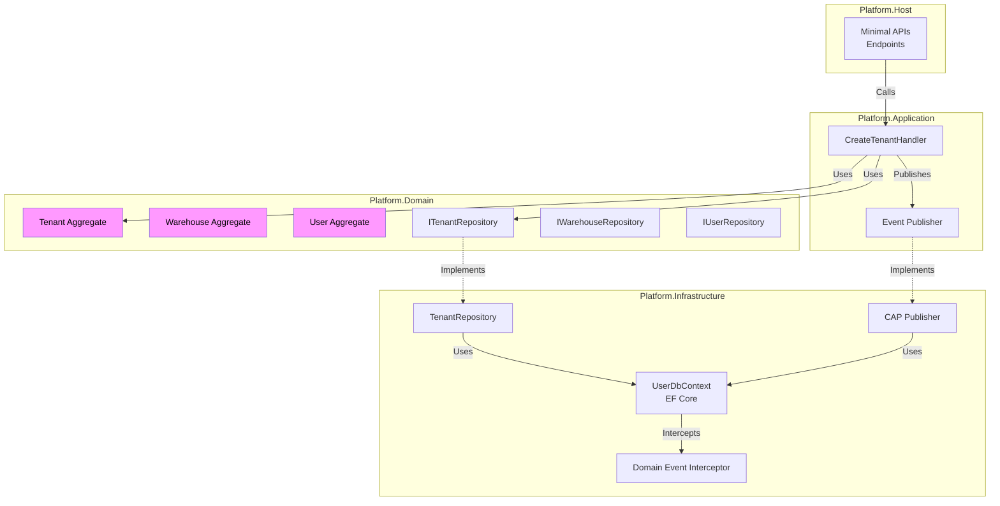

### Level 3: Component Diagram - Inbound Service

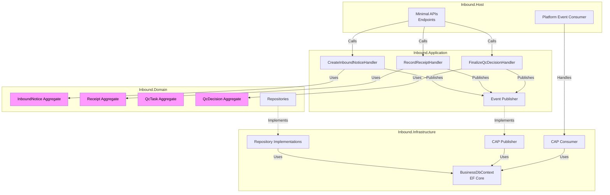

### Level 3: Component Diagram - AI Gateway Service

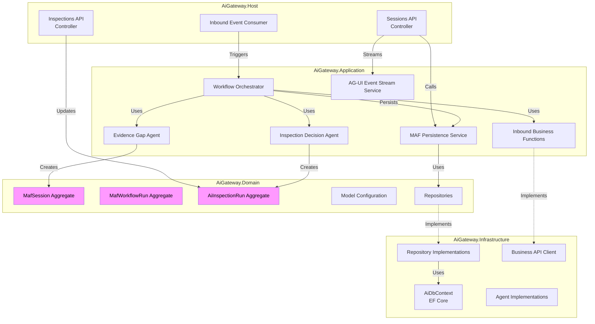

## Bounded Context Relationships

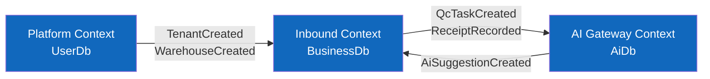

### Context Integration Patterns

1. **Platform → Inbound**: Reference data synchronization
   - Events: `TenantCreatedV1`, `WarehouseCreatedV1`
   - Pattern: Event-carried state transfer
   - Purpose: Maintain tenant/warehouse reference data

2. **Inbound → AiGateway**: Business event triggers
   - Events: `QcTaskCreatedV1`, `ReceiptRecordedV1`
   - Pattern: Domain event notification
   - Purpose: Trigger AI inspection workflows

3. **AiGateway → Inbound**: AI decision feedback
   - Events: `AiSuggestionCreatedV1`
   - Pattern: Command via event
   - Purpose: Provide AI recommendations to business context

## Event Flow Diagrams

### QC Task Creation and AI Inspection Flow

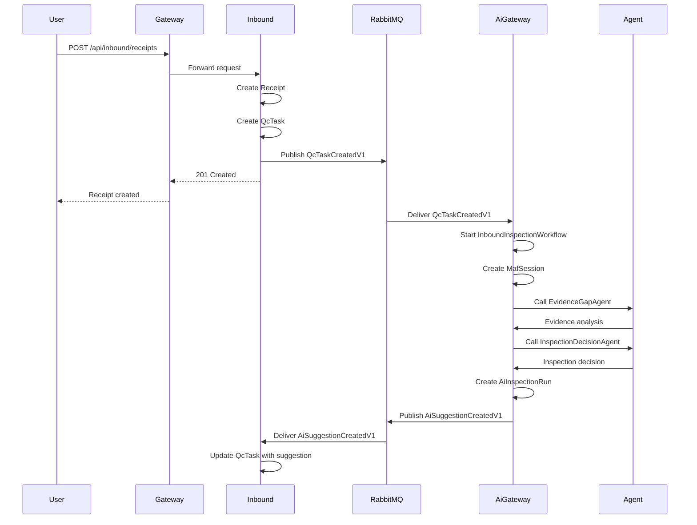

### Manual Review Flow (Human-in-the-Loop)

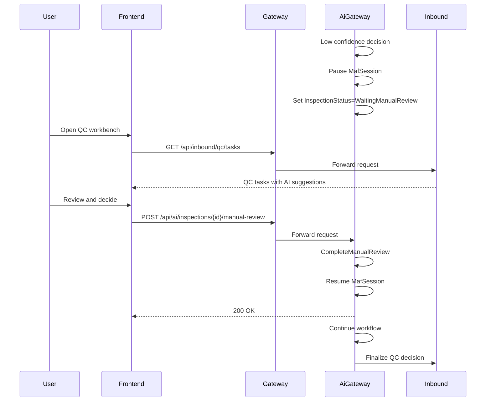

## Database Schema Overview

### UserDb (Platform Context)

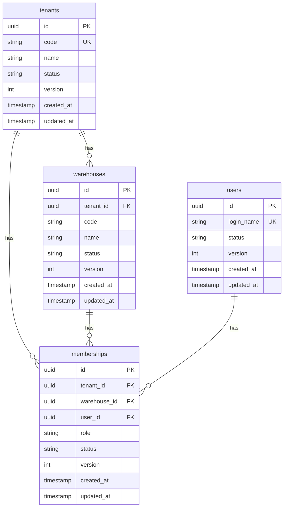

### BusinessDb (Inbound Context)

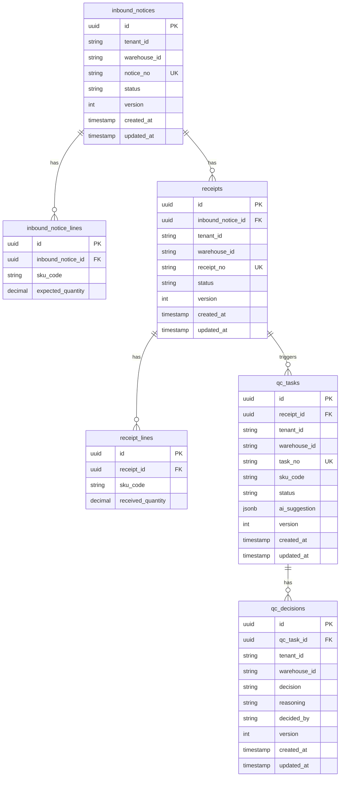

### AiDb (AI Gateway Context)

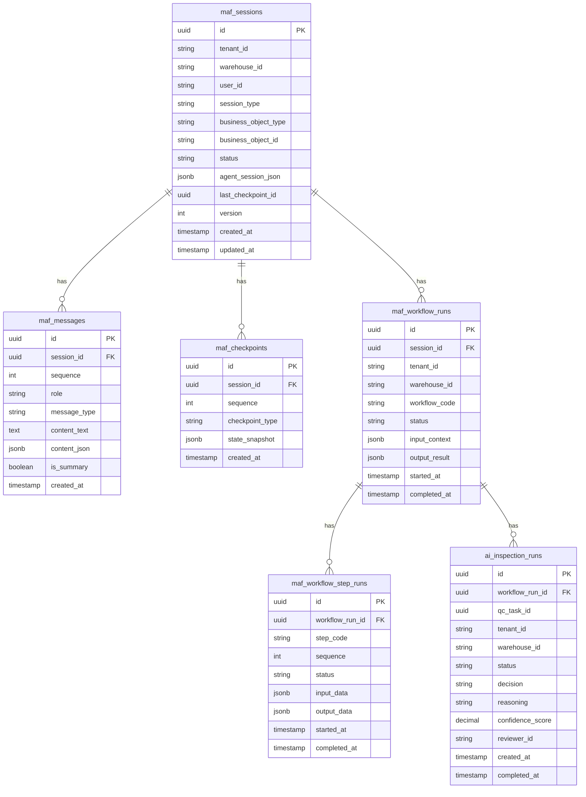

## AI Workflow Architecture

### Multi-Agent Framework (MAF) Architecture

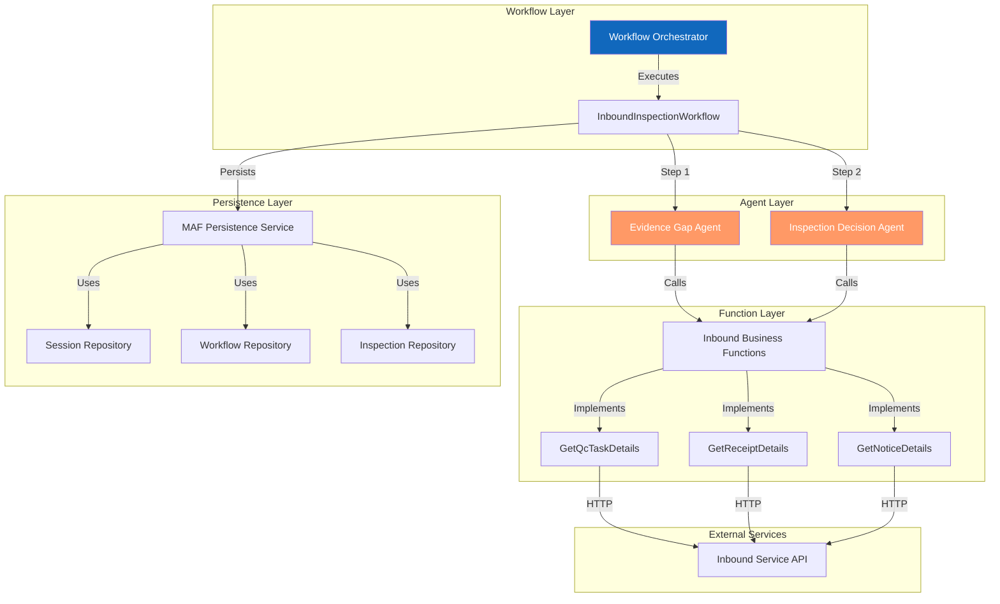

### Workflow Execution Flow

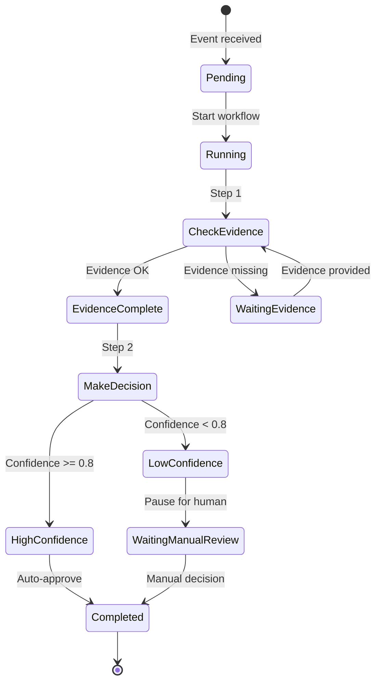

### Session State Management

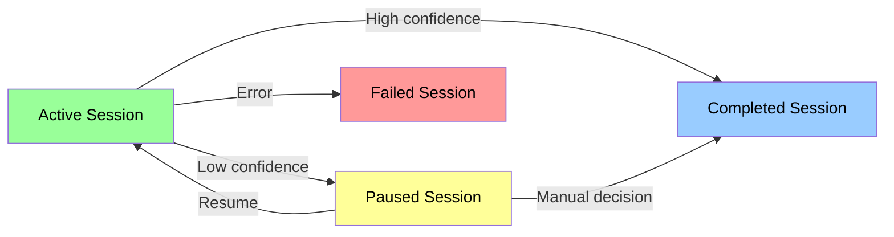

## Cross-Cutting Concerns

### Authentication & Authorization

- **Gateway Middleware**: `FakeIdentityMiddleware` (dev), JWT in production
- **Execution Context**: `RequestExecutionContextMiddleware` injects tenant/warehouse/user
- **Context Propagation**: Execution context flows through all service calls

### Optimistic Concurrency

- **Version Field**: All aggregates have `Version` property
- **Interceptor**: `VersionedEntitySaveChangesInterceptor` handles concurrency checks
- **Conflict Resolution**: Throws `DbUpdateConcurrencyException` on version mismatch

### Domain Events

- **Event Dispatcher**: `DomainEventDispatcher` collects events from aggregates
- **Event Interceptor**: `DomainEventInterceptor` dispatches events after SaveChanges
- **Event Publishing**: CAP publishes events transactionally with database changes

### Distributed Transactions

- **Outbox Pattern**: CAP stores events in same database transaction
- **Eventual Consistency**: Events delivered asynchronously via RabbitMQ
- **Idempotency**: Event handlers must be idempotent (CAP provides deduplication)

## Technology Decisions

### Why .NET Aspire?

- Simplified local development with orchestration
- Built-in service discovery and health checks
- Automatic telemetry and logging configuration
- Easy infrastructure provisioning (PostgreSQL, Redis, RabbitMQ)

### Why CAP Framework?

- Transactional outbox pattern out of the box
- Supports multiple message brokers (RabbitMQ, Kafka)
- Built-in retry and dead letter queue
- Dashboard for monitoring event delivery

### Why PostgreSQL?

- JSONB support for flexible schema (agent state, metadata)
- Strong ACID guarantees for transactional consistency
- Excellent performance for OLTP workloads
- Native support in EF Core

### Why YARP?

- High-performance reverse proxy built on Kestrel
- Configuration-based routing (no code changes)
- Middleware pipeline for authentication/authorization
- Load balancing and health checks

### Why Vue 3?

- Composition API for better code organization
- TypeScript support for type safety
- Excellent performance with virtual DOM
- Rich ecosystem (Element Plus, Pinia, Vue Router)

## Scalability Considerations

### Horizontal Scaling

- **Stateless Services**: All services are stateless (session state in Redis/PostgreSQL)
- **Load Balancing**: YARP can distribute load across multiple instances
- **Database Sharding**: Tenant-based sharding possible (separate databases per tenant)

### Performance Optimization

- **Redis Caching**: Frequently accessed data cached in Redis
- **Connection Pooling**: EF Core connection pooling enabled
- **Async/Await**: All I/O operations are asynchronous
- **Minimal APIs**: Lower overhead than MVC controllers

### Monitoring & Observability

- **Aspire Dashboard**: Real-time service health and metrics
- **CAP Dashboard**: Event delivery monitoring
- **Hangfire Dashboard**: Background job monitoring
- **Structured Logging**: Serilog with structured log output

## Security Considerations

### Authentication

- JWT tokens (production)
- Fake identity middleware (development)
- Token validation in gateway

### Authorization

- Role-based access control (RBAC)
- Tenant/warehouse isolation
- Execution context validation

### Data Protection

- Tenant data isolation at database level
- Encrypted connections (TLS)
- Secrets management (Aspire configuration)

### API Security

- CORS configuration for frontend
- Rate limiting (future)
- Input validation at API boundary

## Future Enhancements

1. **Distributed Tracing**: OpenTelemetry integration
2. **API Versioning**: Support multiple API versions
3. **GraphQL Gateway**: Alternative to REST APIs
4. **Real-time Notifications**: SignalR for push notifications
5. **Advanced AI Features**: Model fine-tuning, A/B testing
6. **Multi-Region Deployment**: Geographic distribution
7. **Kubernetes Deployment**: Container orchestration
8. **Service Mesh**: Istio/Linkerd for advanced networking
