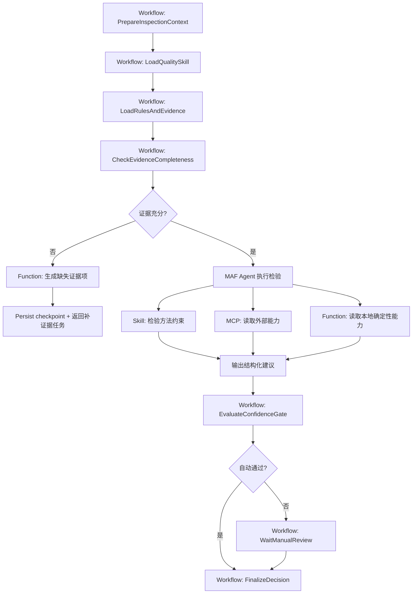

# WMS AI 架构设计

## 总体原则

- 业务服务负责业务真相
- AI 服务负责 AI 会话和建议
- 主流程由 `Workflow` 驱动，不由 Agent 自由发挥
- 普通业务接口走网关
- AG-UI 和 AI 会话走 `AiGateway`

## 服务拆分

## 1. Gateway

职责：

- 统一入口
- 鉴权、限流、CORS、TLS
- 路由到 `Platform`、`Inbound`、`AiGateway`

不负责：

- 业务编排
- AI session 状态

## 2. Platform

职责：

- Tenant
- Warehouse
- User / Role / Membership
- 平台模板
- 平台级配置

数据：

- `UserDb`

## 3. Inbound

职责：

- Sku / Supplier / QualityProfile
- ASN
- Receipt
- QcTask
- Evidence 元数据
- QcDecision

数据：

- `BusinessDb`

## 4. AiGateway

职责：

- AG-UI
- AiSession
- AiCheckpoint
- AiSummarySnapshot
- AiInspectionRun
- AiSuggestion
- 模型路由
- Skill / MCP / Function Calling 装配

数据：

- `AiDb`

## 服务内部结构

每个服务按下面四层组织：

- `Host`
- `Application`
- `Domain`
- `Infrastructure`

不再使用“一个服务 = 一个 Api 项目”的表达方式。

## MAF Workflow 主链

主链不是聊天，而是 durable workflow。

### Workflow 节点建议

1. `PrepareInspectionContext`
2. `LoadQualitySkill`
3. `LoadRulesAndEvidence`
4. `CheckEvidenceCompleteness`
5. `RunInspectionAgent`
6. `NormalizeSuggestion`
7. `EvaluateConfidenceGate`
8. `PersistSuggestion`
9. `AutoPassOrEscalate`
10. `WaitManualReview`
11. `FinalizeDecision`

### 节点职责

#### `PrepareInspectionContext`

- 读取 `QcTask`
- 读取 `Evidence`
- 构建本轮上下文

#### `LoadQualitySkill`

- 装载该类检验任务的 SOP

#### `LoadRulesAndEvidence`

- 读取 SKU 质检规则
- 读取证据元数据和必要引用

#### `CheckEvidenceCompleteness`

- 先判断证据是否足够
- 不够就生成缺失项

#### `RunInspectionAgent`

- 由 `MAF Agent` 执行单步动态判断

#### `NormalizeSuggestion`

- 将模型输出规范成统一结构

#### `EvaluateConfidenceGate`

- 走确定性规则，判断自动通过还是人工复核

#### `PersistSuggestion`

- 落 `AiDb`

#### `AutoPassOrEscalate`

- 发业务事件到 `Inbound`

#### `WaitManualReview`

- 等待人工

#### `FinalizeDecision`

- 在 `BusinessDb` 形成正式结论

## Skill / MCP / Function Calling 分层

## 1. Skill

作用：

- 固化检验方法
- 约束模型行为
- 统一输出口径

示例：

- `inbound-qc-visual-inspection`
- `inbound-qc-label-validation`
- `inbound-qc-evidence-gap-check`
- `inbound-qc-supervisor-review`

## 2. MCP

作用：

- 接外部能力

示例：

- 图像预处理
- 规则仓库查询
- 历史异常查询
- 知识库检索

## 3. Function Calling

作用：

- 接服务内确定性能力

示例：

- 读取 `QcTask`
- 读取证据元数据
- 计算风险标签
- 计算置信度闸门
- 结构化建议校验

## 检验流程图

## 分布式事务落位

## 1. 原则

不用 2PC。  
采用：

- 本地事务
- Outbox
- Inbox
- Saga / 补偿

## 2. 关键跨库链路

### 平台开通

- `Platform` 写 `UserDb`
- 发租户开通事件
- `Inbound` 初始化业务空间
- `AiGateway` 初始化 AI 空间

### AI 建议转业务结论

- `AiGateway` 写 `AiDb`
- 发 `AiSuggestionCreated`
- `Inbound` 消费后形成 `QcDecision`

### 人工复核回写 AI 会话

- `Inbound` 写 `BusinessDb`
- 发 `QcDecisionFinalized`
- `AiGateway` 更新 session/summary

## Aspire 编排

`AppHost` 至少管理：

- Gateway
- Platform Host
- Inbound Host
- AiGateway Host
- PostgreSQL x 3 或逻辑三库
- Redis
- RabbitMQ
- MinIO
- OpenTelemetry Collector

并要求：

- 持久化卷
- Dashboard 可见
- 资源健康检查
- 服务日志、追踪、指标统一接入

## 观测要求

必须可看到：

- HTTP 请求
- EF Core SQL
- RabbitMQ 发布与消费
- 对象存储调用
- MAF session 生命周期
- workflow 节点生命周期
- tool/function/MCP 调用摘要
- checkpoint 创建和恢复
- 模型路由、耗时、token
