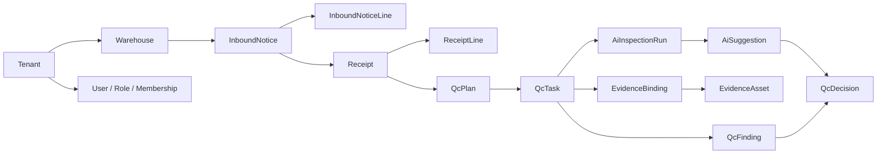
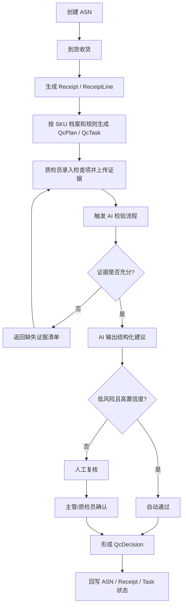

# WMS AI 业务设计

## 目标

第一期只做 `入库质检`，不扩到退货、出库、库内作业。

系统面向两类使用者：

- 平台侧：平台管理员，负责租户、仓库、用户、平台规则模板、平台模型策略
- 租户侧：租户管理员、仓库主管、质检员，负责业务主数据、ASN、收货、质检作业、人工复核

## 第一期开工边界

第一期必须覆盖：

- 多租户、多仓库、统一账号体系
- SKU 基础档案与质量规则档案
- ASN、收货、质检任务、证据上传、AI 建议、人工复核、正式结论
- AG-UI 作业台会话
- 管理端查看异常和 AI 分析结果

第一期不覆盖：

- 退货质检
- 出库与库内流程
- 财务计费
- 跨组织复杂协同

## 核心业务角色

- `PlatformAdmin`
  平台运维、租户开通、平台模型配置、平台模板和高等级审计
- `TenantAdmin`
  租户用户管理、仓库管理、租户级规则和主数据管理
- `WarehouseSupervisor`
  复核、异常处理、仓级分析
- `Inspector`
  收货、执行质检、上传证据、与 AI 协作

## 业务对象

### 平台对象

- `Tenant`
- `Warehouse`
- `User`
- `Role`
- `Membership`

### 主数据对象

- `Supplier`
- `Sku`
- `SkuQualityProfile`

### 入库对象

- `InboundNotice`
- `InboundNoticeLine`
- `Receipt`
- `ReceiptLine`

### 质检对象

- `QcPlan`
- `QcTask`
- `QcFinding`
- `QcDecision`

### 证据对象

- `EvidenceAsset`
- `EvidenceBinding`

### AI 对象

- `AiSession`
- `AiInspectionRun`
- `AiSuggestion`

## 实体流转图

## 业务流程图

## 关键业务规则

### 1. 事实与意图分离

- `InboundNotice` 是业务意图
- `Receipt` 是现场事实
- `QcDecision` 是最终业务真相

不能把三者混成一张状态表。

### 2. AI 建议与业务结论分离

- `AiSuggestion` 只代表 AI 辅助建议
- `QcDecision` 才代表正式质检结论

AI 无权直接覆盖正式结论。

### 3. 证据不足不能硬判通过

AI 在以下场景必须转补证据或人工：

- 图片缺失
- 关键角度缺失
- 标签信息不可读
- 规则要求的检查项未录入
- 模型置信度低于阈值

### 4. 自动通过是一种结论来源，不是独立流程

自动通过仍然要生成：

- 结构化建议
- 规则命中结果
- 置信度记录
- 审计链

### 5. 多租户、多仓库是硬隔离

所有业务主表必须带：

- `TenantId`
- 对仓级数据再带 `WarehouseId`

## 业务闭环解释

这套系统的核心不是“AI 帮我回答问题”，而是：

1. 系统先把入库和质检业务对象建模清楚
2. 再把检验过程拆成稳定节点
3. AI 只在检验节点内部负责解释、建议、补证据追问和风险识别
4. 最终结论仍由业务域落库

只有这样，后续做审计、恢复、复核、指标统计才不会失控。
