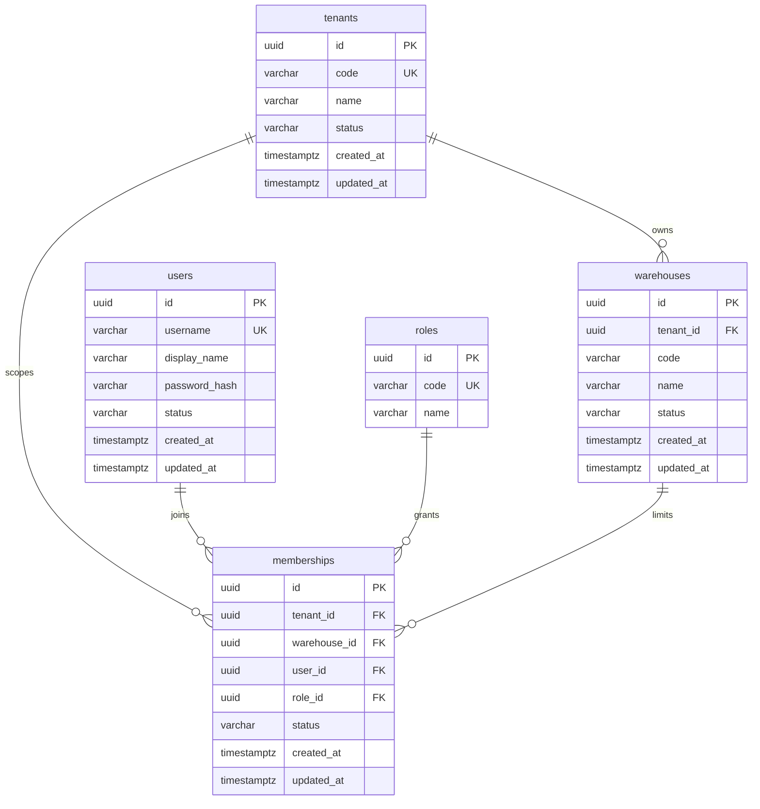
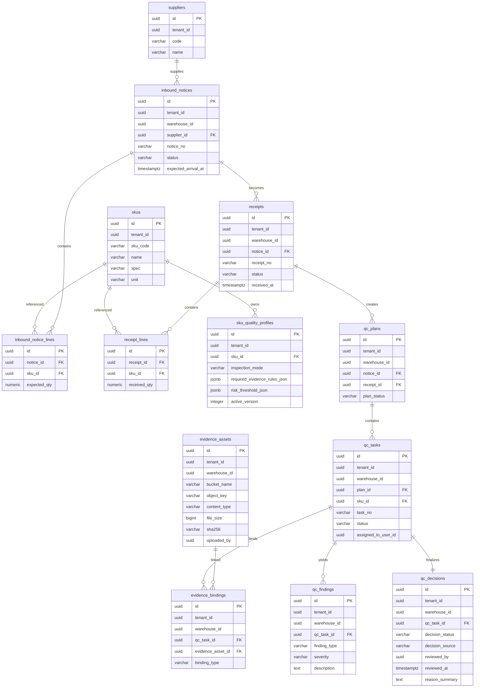
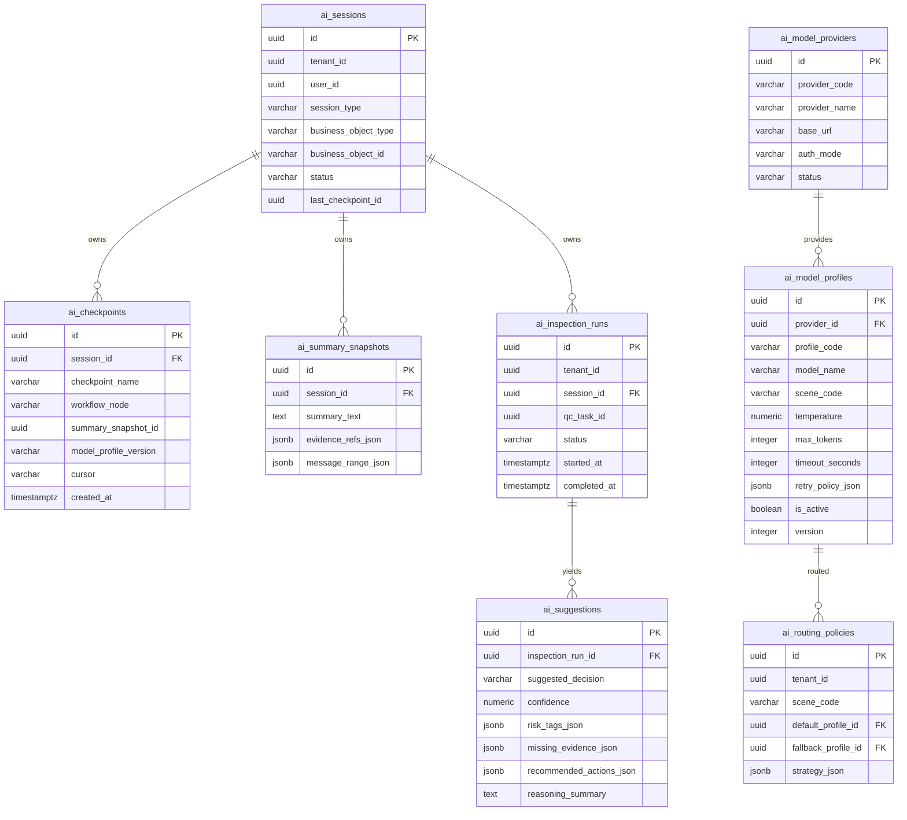

# WMS AI 数据库详细设计

## 目标

把数据库设计从“表清单”推进到“可评审粒度”：

- ERD
- PK / FK / UK
- 索引
- 删除策略
- 并发控制
- 迁移顺序

## 命名基线

统一继承前文约束：

- 表名：`snake_case` 复数
- 列名：`snake_case`
- 主键：`id`
- 外键：`<entity>_id`
- 时间：`*_at`
- 状态：`status`
- 乐观锁：`version`

## 乐观锁基线

所有表统一带：

- `version bigint not null default 1`

用途：

- 作为 `EF Core` 并发令牌
- 每次更新时递增
- 防止并发覆盖

说明：

- 即使是 AI 运行态表，也统一保留 `version`，避免例外规则过多
- 纯追加型日志表理论上很少更新，但为了评审和实现统一，第一期仍统一保留 `version`
- 下方 ERD 为了可读性省略 `version` 列，实际建表必须补上

## 一、UserDb 详细设计

## ERD

## 关键约束

### `tenants`

- `pk_tenants`
- `uk_tenants__code`

### `warehouses`

- `pk_warehouses`
- `fk_warehouses__tenants`
- `uk_warehouses__tenant_id__code`
- `ix_warehouses__tenant_id__status`

### `users`

- `pk_users`
- `uk_users__username`

### `roles`

- `pk_roles`
- `uk_roles__code`

### `memberships`

- `pk_memberships`
- `fk_memberships__tenants`
- `fk_memberships__warehouses`
- `fk_memberships__users`
- `fk_memberships__roles`
- `uk_memberships__tenant_id__warehouse_id__user_id__role_id`
- `ix_memberships__user_id__status`

## 删除策略

- `tenant` 不做物理删除，使用 `status`
- `warehouse` 不做物理删除，使用 `status`
- `user` 不做物理删除，使用 `status`
- `membership` 逻辑失效，不联动删除历史业务数据

## 二、BusinessDb 详细设计

## ERD

## 关键约束

### 主数据

- `uk_suppliers__tenant_id__code`
- `uk_skus__tenant_id__sku_code`
- `uk_sku_quality_profiles__tenant_id__sku_id__active_version`
- `ix_sku_quality_profiles__tenant_id__sku_id`

### 入库

- `uk_inbound_notices__tenant_id__warehouse_id__notice_no`
- `fk_inbound_notice_lines__inbound_notices`
- `fk_inbound_notice_lines__skus`
- `uk_receipts__tenant_id__warehouse_id__receipt_no`
- `fk_receipts__inbound_notices`
- `fk_receipt_lines__receipts`
- `fk_receipt_lines__skus`

### 质检

- `fk_qc_plans__inbound_notices`
- `fk_qc_plans__receipts`
- `uk_qc_tasks__tenant_id__warehouse_id__task_no`
- `fk_qc_tasks__qc_plans`
- `fk_qc_tasks__skus`
- `ix_qc_tasks__tenant_id__warehouse_id__status`
- `ix_qc_tasks__assigned_to_user_id__status`

### 证据

- `uk_evidence_assets__tenant_id__warehouse_id__object_key`
- `uk_evidence_assets__tenant_id__sha256`
- `fk_evidence_bindings__qc_tasks`
- `fk_evidence_bindings__evidence_assets`
- `uk_evidence_bindings__qc_task_id__evidence_asset_id`

### 结论

- `fk_qc_findings__qc_tasks`
- `fk_qc_decisions__qc_tasks`
- `uk_qc_decisions__qc_task_id`
- `ix_qc_decisions__tenant_id__warehouse_id__decision_status`

## 删除策略

- `supplier / sku / sku_quality_profile` 不做物理删除，使用 `status` 或版本停用
- `inbound_notice / receipt / qc_task / qc_decision` 禁止物理删除
- `evidence_binding` 禁止删除；如需失效，增加 `status`
- `evidence_asset` 可做“逻辑失效 + 延迟清理对象存储”

## 并发控制

以下表建议加 `row_version` 或 `xmin` 映射：

- `inbound_notices`
- `receipts`
- `qc_tasks`
- `qc_decisions`

理由：

- 防止多终端重复提交
- 防止人工复核覆盖自动流程结果

## 三、AiDb 详细设计

## ERD

## 关键约束

- `ix_ai_sessions__tenant_id__business_object_type__business_object_id`
- `ix_ai_sessions__tenant_id__user_id__status`
- `fk_ai_checkpoints__ai_sessions`
- `ix_ai_checkpoints__session_id__created_at`
- `fk_ai_summary_snapshots__ai_sessions`
- `fk_ai_inspection_runs__ai_sessions`
- `ix_ai_inspection_runs__tenant_id__qc_task_id__status`
- `fk_ai_suggestions__ai_inspection_runs`
- `uk_ai_model_providers__provider_code`
- `uk_ai_model_profiles__profile_code__version`
- `ix_ai_model_profiles__scene_code__is_active`
- `uk_ai_routing_policies__tenant_id__scene_code`

## 删除策略

- `ai_sessions` 不做物理删除，进入 `archived`
- `ai_checkpoints / ai_summary_snapshots / ai_inspection_runs / ai_suggestions` 根据归档周期清理
- `ai_model_profiles` 只做停用和新版本，不删除历史版本

## 四、通用索引策略

## 必备过滤索引

所有租户仓级表至少保证：

- `(tenant_id, warehouse_id, status)`

所有业务单号类表至少保证：

- `(tenant_id, warehouse_id, <business_no>)`

所有 AI 业务对象映射至少保证：

- `(tenant_id, business_object_type, business_object_id)`

## JSONB 策略

仅在以下场景使用 `jsonb`：

- 规则快照
- 风险标签
- 缺失证据清单
- 推荐动作
- 路由策略

不把核心关系字段塞进 `jsonb`。

## 五、迁移顺序

建议顺序：

1. `UserDb`
2. `BusinessDb`
3. `AiDb`
4. `CAP` 相关表
5. `Quartz` 相关表

理由：

- 先保证租户和用户空间
- 再保证业务真相
- 再保证 AI 运行时
- 最后补基础设施运行表

## 六、评审必问点

评审时必须明确回答：

- 为什么要三库拆分
- 为什么关键表不用物理删除
- 为什么 `qc_decisions` 只允许一条正式记录
- 为什么模型配置必须版本化
- 为什么 JSONB 只用于快照和策略，不用于核心关系
